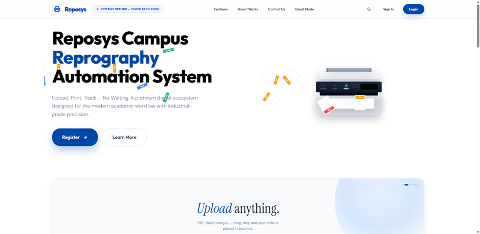

# 🖨️ REPOSYS — Reprography Automation System

<p align="center">
  <strong>Upload. Track. Print. No Waiting.</strong>
</p>

<p align="center">
  A full-stack platform for automated reprography, document management,
  payments, queue management, and real-time order tracking.
</p>

<p align="center">
  <a href="https://reposyson.vercel.app">🌐 Live Demo</a> •
  <a href="https://github.com/jefri-sys/Reposys">📂 GitHub Repository</a> •
  <a href="https://github.com/jefri-sys/Reposys/issues">🐛 Issues</a>
</p>

<p align="center">


</p>

---

## 📌 About

**REPOSYS (Reprography Automation System)** is a full-stack digital platform designed to modernize the traditional reprography workflow.

It brings **document submission, printing, photocopying, scanning, binding, payments, queue management, real-time tracking, and pickup** into one connected system.

The platform provides dedicated experiences for:

- 🎓 Students & Faculty
- 🧑‍💼 Counter Staff
- 👨‍💻 Administrators
- 👤 Guest Users

From **uploading a document and placing an order** to **queue processing, live status updates, and OTP-verified pickup**, REPOSYS connects the complete workflow in a single platform.

> **Upload. Track. Print. No Waiting.**

---
# 📸 Screenshots

## 🖥️ Web Application

<table>
<tr>
<td width="50%">

### Landing Page



</td>
<td width="50%">

### Login


</td>
</tr>

<tr>
<td width="50%">

### Registration


</td>
<td width="50%">

### Guest Mode


</td>
</tr>

<tr>
<td width="50%">

### User Dashboard


</td>
<td width="50%">

### Live Order Tracking


</td>
</tr>

<tr>
<td width="50%">

### My Orders


</td>
<td width="50%">

### Staff Console


</td>
</tr>

<tr>
<td width="50%">

### Admin Dashboard


</td>
<td width="50%">

### Admin Pricing


</td>
</tr>

<tr>
<td width="50%">

### Admin Tools


</td>
<td width="50%">

### Print Automation


</td>
</tr>

<tr>
<td width="50%">

### Printer Management


</td>
<td></td>
</tr>

</table>

---

## 📱 Mobile & PWA

<p align="center">


</p>

<p align="center">


</p>
# ✨ Key Features

## 👨‍🎓 Student & Faculty

- 📄 Upload documents
- 🖨️ Print & photocopy orders
- 📑 Scanning and binding services
- 💰 Online payment
- 💳 Digital wallet
- 📦 Multi-document orders
- 📍 Real-time order tracking
- 🔔 Real-time notifications
- 🎟️ Priority queue
- ⏰ Pickup slots
- 🔐 OTP-verified pickup
- 📝 Order editing and cancellation
- ⭐ Ratings and feedback
- 💬 Complaints and support
- 🤖 AI Assistant
- 👥 Friend & split requests
- 📱 PWA / mobile experience

---

## 🧑‍💼 Counter Staff

- 📊 Staff dashboard
- 🔄 Live order queue
- ⚡ Priority order handling
- 🖨️ Print processing
- 📑 Document processing
- 📦 Partial order processing
- 🔔 Real-time order updates
- 💵 Cash / counter payment handling
- 📋 Order status management
- 🖨️ Printer management
- ⚙️ Print automation controls

---

## 👨‍💻 Administration

- 📊 Analytics dashboard
- 💰 Revenue monitoring
- 🏷️ Dynamic pricing management
- 🛠️ Service and tool management
- 📦 Inventory management
- 📈 Inventory forecasting
- 🖨️ Printer management
- ⚙️ Print automation
- 👥 User management
- 📝 Activity logs
- 📢 Notifications
- 📊 Reports
- ⚙️ System configuration

---

## 👤 Guest Mode

REPOSYS supports guest users who can access selected services without creating a permanent account.

- 🔐 Temporary guest authentication
- 📄 Document submission
- 🧾 Order creation
- 📍 Order tracking
- 🔢 OTP-based verification
- ⏳ Restricted temporary session

---

# 🔄 How REPOSYS Works

```text
                 👤 USER
                    │
                    ▼
             📄 Upload Document
                    │
                    ▼
               🛒 Create Order
                    │
                    ▼
               💳 Make Payment
                    │
                    ▼
               ⚡ Queue System
                    │
                    ▼
             🧑‍💼 Staff Processing
                    │
                    ▼
                 🖨️ Printing
                    │
                    ▼
              📦 Order Completed
                    │
                    ▼
                🔐 OTP Pickup
