# REPOSYS

### Reprography Automation System

<p align="center">
  <strong>A digital platform for managing printing, photocopying, scanning, binding, payments, queues, and reprography operations.</strong>
</p>

<p align="center">


</p>

<p align="center">

[🌐 Live Demo](#) •
[📂 Repository](.) •
[🐛 Issues](../../issues)

</p>

---

## 📸 Screenshots

### 🖥️ Web Application

<table>
<tr>
<td width="50%">

#### Landing Page


</td>
<td width="50%">

#### Login

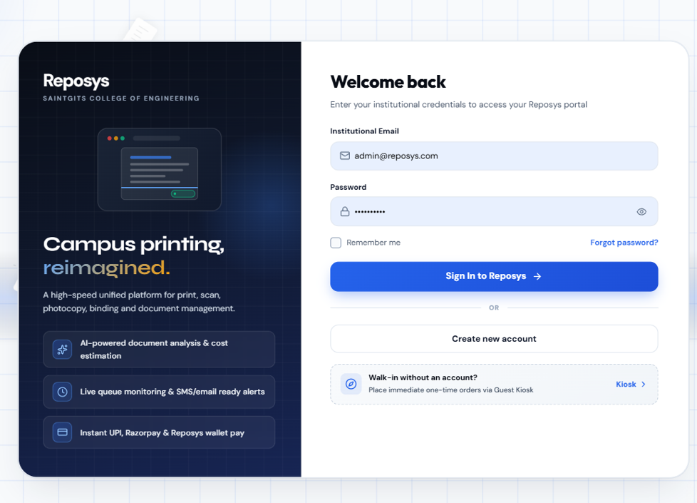

</td>
</tr>

<tr>
<td width="50%">

#### Registration

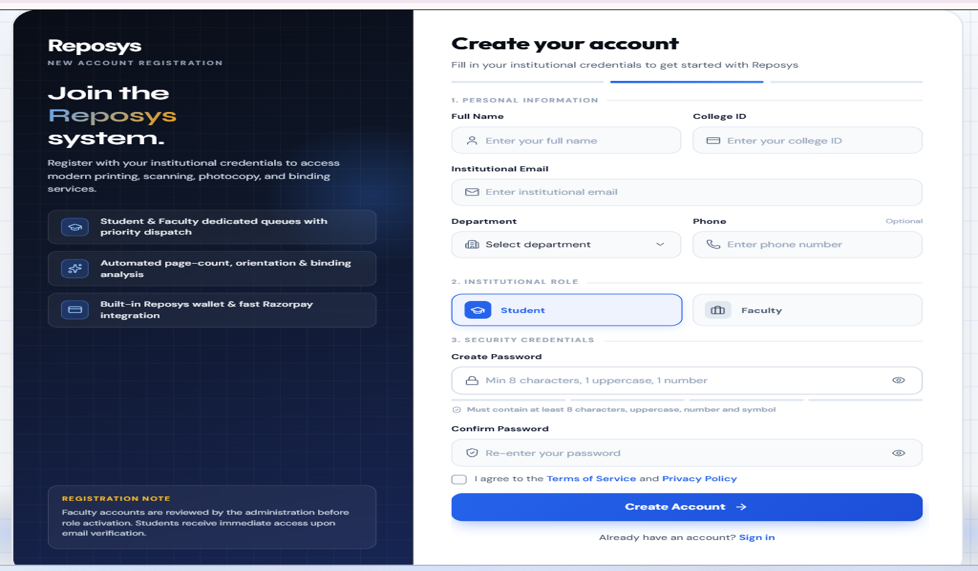

</td>
<td width="50%">

#### Guest Mode

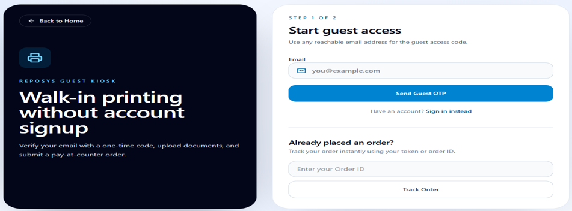

</td>
</tr>

<tr>
<td width="50%">

#### User Dashboard

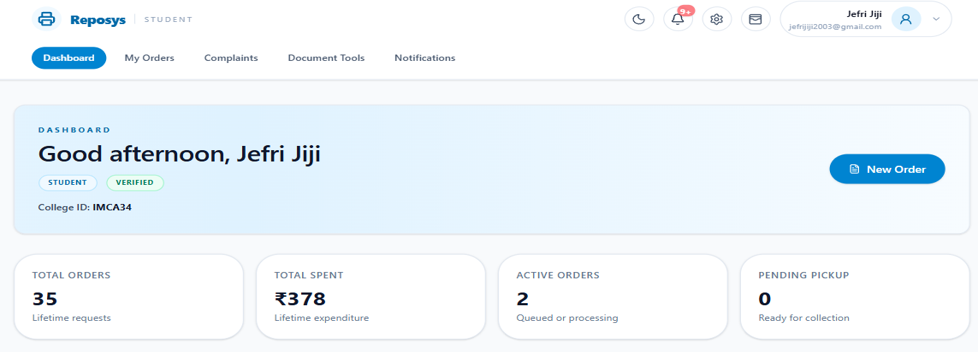

</td>
<td width="50%">

#### Live Order Tracking

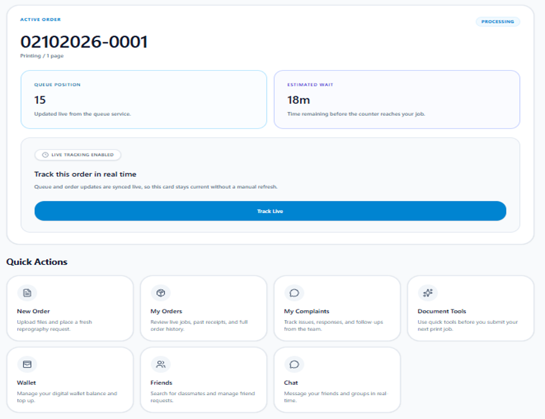

</td>
</tr>

<tr>
<td width="50%">

#### My Orders

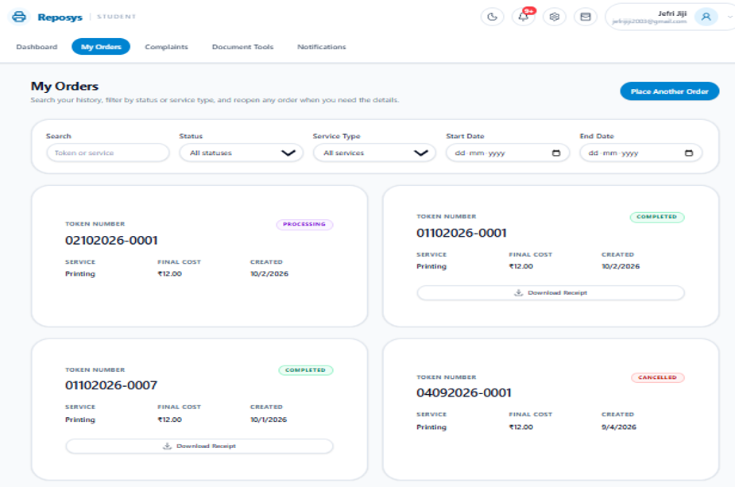

</td>
<td width="50%">

#### Staff Console

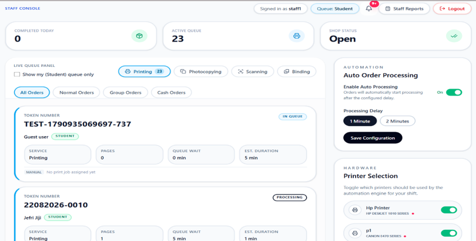

</td>
</tr>

<tr>
<td width="50%">

#### Admin Dashboard

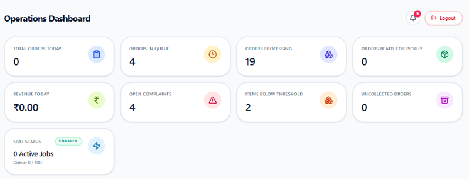

</td>
<td width="50%">

#### Admin Pricing

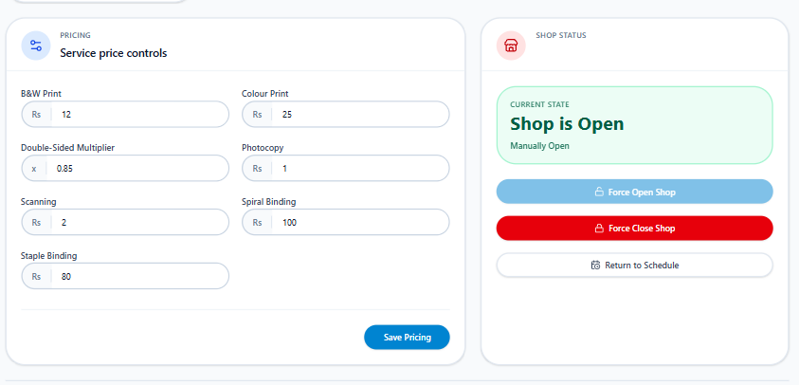

</td>
</tr>

<tr>
<td width="50%">

#### Admin Tools

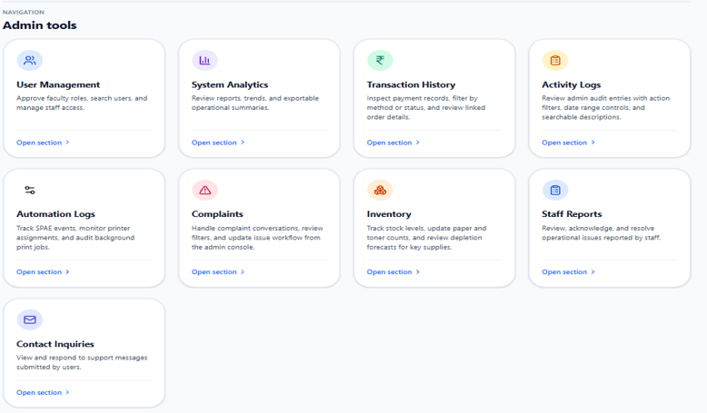

</td>
<td width="50%">

#### Print Automation

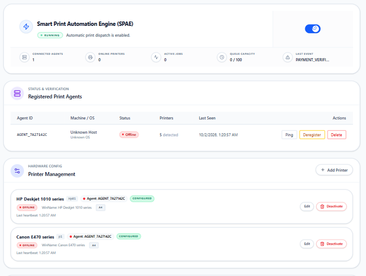

</td>
</tr>

<tr>
<td width="50%">

#### Printer Management

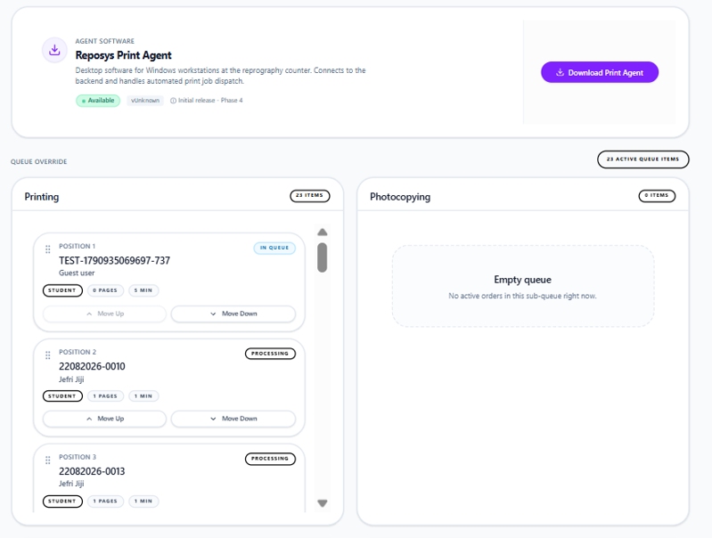

</td>
<td></td>
</tr>
</table>

---

### 📱 Mobile & PWA

<p align="center">
  

  

  

  
</p>

<p align="center">
  

  

  
</p>

---

## 💡 About REPOSYS

**REPOSYS** is a full-stack reprography automation platform designed to replace traditional manual printing-counter workflows with a centralized digital experience.

Users can manage their documents, configure services, place orders, make payments, monitor queue progress, receive real-time updates, and collect completed orders.

The platform also provides dedicated interfaces for **counter staff and administrators** to manage operations, queues, inventory, payments, analytics, and system activities.

---

## ✨ Features

### 👤 User

- 📄 Document upload and preview
- 🖨️ Printing, photocopying, scanning and binding
- 📦 Multi-document orders
- 💰 Smart cost estimation
- 💳 Online, wallet and cash payments
- ⚡ Priority-based queue
- 📍 Real-time order tracking
- 🕐 Preferred pickup slots
- ✏️ Order editing and cancellation
- 🔐 OTP-based pickup verification
- 🧾 Digital receipts
- 🔄 Reorder functionality
- 🔔 Notifications
- 💬 Complaints and support
- ⭐ Ratings and feedback
- 🤖 AI-assisted document features
- 👥 Friends and group chat
- 💸 Split payments

### 🧑‍💼 Counter Staff

- Live order queue
- Priority-based processing
- Order locking
- Processing management
- Partial order completion
- Cash collection
- Pickup verification
- Staff reports
- Inventory-related operations

### 🛡️ Administration

- Centralized admin dashboard
- User management
- Order management
- Pricing controls
- Revenue analytics
- Payment analytics
- Inventory management
- Demand forecasting
- Activity logs
- Staff reports
- Shop schedule management
- System configuration

### 🚶 Guest Mode

- OTP-based guest access
- Document upload
- One-time order placement
- Pay-at-counter workflow
- Order tracking
- Pickup verification

---

## ⚡ How It Works

```text
                    REPOSYS
                       │
                       ▼
               Upload Document
                       │
                       ▼
              Configure Services
                       │
                       ▼
               Cost Estimation
                       │
                       ▼
                    Payment
                       │
                       ▼
                Priority Queue
                       │
                       ▼
               Staff Processing
                       │
                       ▼
              Real-Time Tracking
                       │
                       ▼
                Ready for Pickup
                       │
                       ▼
               OTP Verification
                       │
                       ▼
                  COMPLETED
```

---

## 🧰 Tech Stack

| Layer | Technologies |
|---|---|
| **Frontend** | React, Vite, React Router, Axios, PDF.js |
| **Styling** | CSS / Responsive UI |
| **Backend** | Node.js, Express.js |
| **Database** | MongoDB, Mongoose |
| **Real-Time** | Socket.IO |
| **Authentication** | JWT, bcrypt |
| **Payments** | Razorpay, Wallet, Cash |
| **File Storage** | Cloudinary |
| **AI** | Google Gemini |
| **Document Processing** | PDF.js, CloudConvert |
| **Notifications** | Web Push / VAPID |
| **PWA** | Service Worker, Web App Manifest |

---

## 🏗️ Architecture

```text
                         ┌────────────────────┐
                         │      REPOSYS       │
                         │   React + Vite     │
                         └─────────┬──────────┘
                                   │
                         REST API  │  Socket.IO
                                   │
                         ┌─────────▼──────────┐
                         │      Backend       │
                         │ Node.js + Express  │
                         └─────────┬──────────┘
                                   │
                         ┌─────────▼──────────┐
                         │      MongoDB       │
                         │    MongoDB Atlas   │
                         └────────────────────┘
                                   │
             ┌─────────────────────┼─────────────────────┐
             │                     │                     │
       ┌─────▼─────┐        ┌──────▼─────┐       ┌──────▼──────┐
       │ Cloudinary │        │  Razorpay  │       │   Gemini    │
       │   Storage  │        │  Payments  │       │     AI      │
       └────────────┘        └────────────┘       └─────────────┘
```

---

## 📱 Mobile Experience

REPOSYS is designed to work beyond the desktop browser through its Progressive Web App experience.

The mobile interface provides access to:

- Dashboard
- Orders
- Live tracking
- Wallet
- Friends
- Chat
- Settings
- AI Assistant
- Notifications

---

## 🤖 AI Assistant

The integrated **REPOSYS Assistant** provides contextual assistance within the application, including information related to queue status, pricing and reprography operations.

---

## 🖨️ Print Automation

REPOSYS includes a dedicated print automation layer for connecting the digital order workflow with physical printing operations.

The system provides interfaces for:

- Print-agent management
- Printer registration
- Printer status
- Printer selection
- Queue assignment
- Automated print processing

---

## 🔄 Real-Time Operations

Socket.IO enables real-time communication between users, staff and the system.

```text
User
 │
 ├── Order Status
 ├── Queue Position
 ├── Notifications
 └── Chat
          │
          ▼
     Socket.IO
          │
          ├── Staff
          ├── Admin
          └── Other Users
```

---

## 🌟 Why REPOSYS?

### Traditional Workflow

```text
Submit Document
       ↓
Wait at Counter
       ↓
Manual Processing
       ↓
Payment
       ↓
Collect
```

### REPOSYS

```text
Upload
  ↓
Configure
  ↓
Pay
  ↓
Track
  ↓
Collect
```

**One platform. One workflow. Less waiting.**

---

## 📊 Platform

| Capability | Status |
|---|:---:|
| Document Management | ✅ |
| Digital Ordering | ✅ |
| Online Payment | ✅ |
| Wallet | ✅ |
| Cash Payment | ✅ |
| Priority Queue | ✅ |
| Real-Time Tracking | ✅ |
| Staff Console | ✅ |
| Admin Dashboard | ✅ |
| Inventory Management | ✅ |
| Analytics | ✅ |
| Guest Mode | ✅ |
| PWA | ✅ |
| AI Assistant | ✅ |
| Chat | ✅ |
| Print Automation | ✅ |
| OTP Pickup | ✅ |

---

## 🎓 Project

**REPOSYS — Reprography Automation System**

A full-stack software engineering project focused on digitizing and automating reprography services through a unified web and mobile experience.

---

## 👨‍💻 Author

### Jefri Jiji

**Integrated MCA**  
Saintgits College of Engineering

---

## 📄 License

This project is developed as an academic software project.

---

<p align="center">

### ⭐ If you find REPOSYS interesting, consider starring the repository.

</p>
